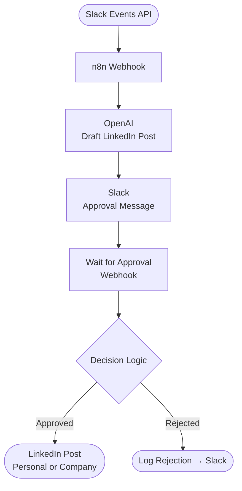

# Slack → OpenAI → LinkedIn Publisher

An n8n workflow that listens for messages in a Slack channel, uses OpenAI (GPT-4.1 mini) to generate a polished LinkedIn post draft, routes it through a human approval gate, and then publishes it to LinkedIn — all with structured error logging back to Slack.

This repository contains everything needed to run an **end-to-end automation** that:

1. Listens to messages in Slack
2. Sends them to OpenAI for drafting a LinkedIn post
3. Sends the draft to Slack for approval
4. Posts the approved content to LinkedIn (personal or company page)

The workflow is built in **n8n**, runs locally via **Docker**, and uses **ngrok** for Slack webhooks — ngrok is bundled inside the Docker image, so no separate installation is required.

---

## Architecture Overview



---

## Prerequisites

Each teammate must install the following **locally**:

### Required Software
- **Docker Desktop**  
  https://www.docker.com/products/docker-desktop
- **Git**  
  https://git-scm.com/
- A modern browser (Chrome recommended)

> **ngrok is bundled inside the Docker image.** No separate ngrok download or installation is needed.

### Required Accounts
- Slack workspace where you can create apps
- LinkedIn account (admin access required for company posting)
- OpenAI account with API access

---

## Repository Structure

```
linkedin-article-agent/
│
├── Dockerfile                  ← Custom image: n8n + ngrok
├── docker-compose.yml
├── docker-entrypoint.sh        ← Starts ngrok (optional) then n8n
├── .dockerignore
├── .gitignore
│
├── workflow/
│   └── Slack → OpenAI → LinkedIn Publisher.json
│
├── scripts/
│   └── script.p1
│
└── README.md
```

---

## Step 1 — Clone the Repository

```bash
git clone https://github.com/YOUR_ORG/slack-to-linkedin-n8n.git
cd slack-to-linkedin-n8n
```

---

## Step 2 — Create `.env` File

Copy the example file and fill in the placeholders.

```bash
cp .env.example .env
```

### `.env` variables explained

```env
# n8n runtime
N8N_HOST=localhost
N8N_PORT=5678
N8N_PROTOCOL=http
N8N_EDITOR_BASE_URL=https://your-ngrok-domain.ngrok-free.app
N8N_ENCRYPTION_KEY=                    # generate: openssl rand -hex 16
N8N_BLOCK_ENV_ACCESS_IN_NODE=false

# Public base URL used for webhook callbacks and approval button links
WEBHOOK_URL=https://your-ngrok-domain.ngrok-free.app

# ngrok — omit NGROK_AUTHTOKEN entirely to disable ngrok
NGROK_AUTHTOKEN=                       # from https://dashboard.ngrok.com
# NGROK_DOMAIN=your-static-subdomain.ngrok-free.app  # optional static domain
```

> **Service credentials** (OpenAI API key, Slack Bot Token, LinkedIn OAuth) are stored inside n8n's encrypted database and configured via the n8n UI — they are not read from `.env`.

⚠️ **Never commit `.env` to GitHub**

---

## Step 3 — Build and Start the Container

```bash
docker compose up -d --build
```

This builds the custom image (n8n + ngrok), then starts the container.

Verify:
- n8n UI: http://localhost:5678
- ngrok: started automatically inside the container when `NGROK_AUTHTOKEN` is set in `.env`

To confirm ngrok is running:

```bash
docker compose logs n8n | grep -i ngrok
```

---

## Step 4 — Confirm the ngrok Tunnel URL

If you set `NGROK_DOMAIN` in `.env`, your tunnel URL is fixed and never changes — skip the rest of this step.

If you did **not** set `NGROK_DOMAIN`, inspect the container logs to find the assigned URL:

```bash
docker compose logs n8n
```

Look for a line like:
```
Forwarding https://revisional-xxxxx.ngrok-free.dev -> http://localhost:5678
```

👉 **Copy the HTTPS ngrok URL** — you will need it in the Slack app setup below.

---

## Step 5 — Import the Workflow into n8n

1. Open http://localhost:5678
2. Click **Import Workflow**
3. Import:
   ```
   workflows/slack_to_linkedin_approval.json
   ```
4. Save the workflow

---

## Step 6 — Create Credentials in n8n

### OpenAI
- Credentials → New → **HTTP Header Auth** (or OpenAI if using native node)
- Header:
  ```
  Authorization: Bearer sk-xxxx
  ```

### Slack
- Credentials → New → **Slack**
- Use **Bot User OAuth Token**
- Token starts with `xoxb-...`

### LinkedIn
- Credentials → New → **LinkedIn OAuth2 API**
- Requires LinkedIn App (see below)

---

## Step 7 — Slack App Setup (Critical)

### Create Slack App
1. https://api.slack.com/apps → **Create New App**
2. Choose **From scratch**
3. Select your workspace

### OAuth & Permissions
Add bot scopes:
- `chat:write`
- `channels:read`
- `channels:history`
- `groups:read` (if using private channels)

Install app to workspace.

### Event Subscriptions
1. Enable **Event Subscriptions**
2. Request URL:
   ```
   https://YOUR_NGROK_DOMAIN/webhook/slack/events
   ```
3. Wait for **Verified**
4. Subscribe to bot events:
   - `message.channels`
   - `message.groups` (if private)

### Invite bot to channels
In Slack:
```
/invite @YourBotName
```

---

## Step 8 — LinkedIn App Setup

### Create LinkedIn App
https://www.linkedin.com/developers/apps

### OAuth Settings
- Redirect URL:
  ```
  http://localhost:5678/rest/oauth2-credential/callback
  ```

### Required Scopes
Personal posting:
- `w_member_social`
- `openid`
- `profile`
- `email`

Company posting:
- `w_organization_social`
- Must be approved by LinkedIn
- You must be an admin of the Page

⚠️ After changing scopes, **re-authenticate** in n8n.

---

## Step 9 — Webhook URLs After Restart

**If `NGROK_DOMAIN` is set** (recommended): the tunnel URL is static and never changes — no action needed on restart.

**If `NGROK_DOMAIN` is not set**: ngrok assigns a new random URL every time the container restarts. When that happens:

1. Get the new ngrok URL from container logs: `docker compose logs n8n`
2. Update:
   - Slack Event Subscriptions → Request URL
   - `.env` → `WEBHOOK_URL` and `N8N_EDITOR_BASE_URL`
3. Restart the container: `docker compose restart`

---

## Step 10 — Activate the Workflow

In n8n:
- Open the workflow
- Toggle **Active** → ON

⚠️ Slack production webhooks **only work when Active**

---

## Step 11 — Test End-to-End

1. Send a message in Slack source channel:
   ```
   hello world
   ```
2. n8n drafts LinkedIn post via OpenAI
3. Approval message appears in approval channel
4. Click **Approve**
5. Post appears on LinkedIn

---

## Common Issues & Fixes

### “Unknown webhook”
- Workflow not Active
- Wrong URL (`/webhook-test` instead of `/webhook`)
- ngrok URL changed

### Slack `channel_not_found`
- Use **channel ID**, not name
- Invite bot to channel

### LinkedIn 422 error
- Missing `visibility`, `lifecycleState`, or `specificContent`
- Body must be valid JSON or Expression mode

### Approval loses draft text
- Ensure **Store Draft → Merge → Approval Decision** pattern is used

---

## Security Notes

- Never commit `.env`
- Never commit `n8n_data/`
- Credentials are encrypted locally using `N8N_ENCRYPTION_KEY`

---
## Overview

| Property | Value |
|---|---|
| Trigger | Slack event webhook (message posted in a channel) |
| AI Model | `gpt-4.1-mini` via OpenAI Responses API |
| Approval | Human-in-the-loop via Slack reply |
| Output | LinkedIn post (via HTTP API) |
| Logging | Slack channel notifications for all outcomes |
| Total Nodes | 25 |

---

## How It Works

### 1. Trigger — Slack Webhook
The workflow starts when Slack sends an event to an n8n webhook. A JavaScript code node handles Slack's URL verification challenge and normalises the incoming event payload (extracting `text`, `user`, `channel`, `ts`, etc.).

### 2. Ignore Rules
Before doing anything expensive, a filter node drops messages that should be skipped:
- Message starts with `!skip`
- Message text is empty
- Message was sent by a bot (`bot_id` is present)
- Message is a thread reply (`thread_ts` is present)

Filtered messages go to a **Stop** (no-op) node. Valid messages continue.

### 3. Respond to Webhook (Immediately)
A `Respond to Webhook` node fires in parallel immediately after the initial parse — this acknowledges Slack's event delivery within the required 3-second window so Slack doesn't retry.

### 4. Prepare Input
Extracts and renames the fields needed downstream into a clean object: `raw_text`, `source_channel`, `source_user`, `source_ts`.

### 5. OpenAI API Call
Sends the Slack message text to `https://api.openai.com/v1/responses` with a structured system prompt instructing the model to return a JSON object containing:

| Field | Description |
|---|---|
| `post_text` | 4–6 sentence LinkedIn post body |
| `post_link` | `"Read more here: <url>"` (the article link, separate from post text) |
| `hashtags` | Array of relevant hashtag strings |
| `safety_ok` | Boolean — whether the content is safe to post |
| `notes` | Any caveats or rejection reasons from the model |

### 6. Parse OpenAI Response
A JavaScript code node extracts the model's text output from the Responses API structure and parses it as JSON. If parsing fails, it returns an error flag and the raw response for logging.

### 7. Config / Constants
Sets shared runtime constants used throughout the rest of the workflow:
- `log_channel_id` — Slack channel ID for all log/error messages
- `approval_channel_id` — Slack channel ID where approval requests are sent

### 8. Check Parse Error
If the OpenAI response couldn't be parsed as valid JSON, the workflow branches to **Log Parse Error**, which posts a ⚠️ message to the log Slack channel including the error, the original Slack message, and the raw OpenAI response.

### 9. Safety Gate
If `safety_ok` is `false`, the workflow branches to **Log Safety Failure**, which posts a 🛑 message to the log channel with the model's rejection reason and any safer alternative it suggested.

### 10. Human Approval Loop
If the content passes the safety check:

1. **Store Draft** — saves the draft post fields into state for later merging.
2. **Send For Approval** — posts the draft LinkedIn post to the approval Slack channel, asking for a reply of `approve` or `reject`.
3. **Wait For Approval Reply** — the workflow pauses here using n8n's Wait node until a Slack reply comes back.
4. **Merge Draft + Decision** — merges the stored draft with the approval reply.
5. **Approval Decision** — checks whether the reply contains `approve`.

### 11. On Approval — Publish to LinkedIn
1. **Build Final LinkedIn Text** — formats hashtags (ensures each starts with `#`) and concatenates them onto the post text to produce `final_text`.
2. **LinkedIn Post** — sends an HTTP POST request to the LinkedIn API to publish the post.
3. **Log Success** — posts a ✅ confirmation to the Slack log channel.

### 12. On Rejection — Log and Stop
If the approver replied with anything other than `approve`, the workflow logs a rejection message to the Slack channel and stops.

---

## Workflow Diagram

```
Slack Webhook
     │
     ├──► Respond to Webhook (immediate 200 OK)
     │
Code: Parse Slack Event
     │
Ignore Rules ──► [Stop]
     │
Prepare Input
     │
OpenAI API Call (gpt-4.1-mini)
     │
Code: Parse JSON Response
     │
Config / Constants
     │
Check Parse Error ──► [Log Parse Error → Slack]
     │
Safety Gate ──► [Log Safety Failure → Slack]
     │
Store Draft ──► Send For Approval → Wait For Reply
                                         │
                              Merge Draft + Decision
                                         │
                               Approval Decision
                              ┌──────────┴──────────┐
                          [Approved]            [Rejected]
                              │                     │
                  Build Final LinkedIn Text   Config/Constants2
                              │                     │
                        LinkedIn Post         Log Rejection
                              │                     │
                   Config / Constants1        Log Error → Slack
                              │
                        Log Success → Slack
```

---

## Setup & Configuration

### Required Credentials

| Service | Credential Type | Where Used |
|---|---|---|
| Slack | Slack API (Bot Token) | Webhook trigger, all Slack nodes |
| OpenAI | OpenAI API Key | HTTP Request node (Bearer token) |
| LinkedIn | LinkedIn API Token | LinkedIn Post HTTP Request node |

### Slack App Requirements
Your Slack app must have the following enabled:
- **Event Subscriptions** — point the Request URL to the n8n webhook URL for this workflow
- Subscribe to **`message.channels`** bot event (or whichever channel scope applies)
- **Bot Token Scopes:** `chat:write`, `channels:history`, `channels:read`

### Channel IDs to Configure
Update the three **Config / Constants** nodes with your actual Slack channel IDs:

| Variable | Description |
|---|---|
| `log_channel_id` | Channel where errors, safety failures, rejections, and successes are posted |
| `approval_channel_id` | Channel where draft posts are sent for human review |

### OpenAI Model
The workflow uses `gpt-4.1-mini`. To use a different model, update the `jsonBody` in the **HTTP Request** node.

---

## Skipping Messages

Any message posted to the monitored Slack channel that starts with `!skip` will be silently ignored. This is useful for posting notes or links you don't want turned into LinkedIn posts.

---

## Error Handling

| Scenario | Behaviour |
|---|---|
| OpenAI JSON parse failure | Logs raw response + error to Slack log channel |
| Content fails safety check | Logs reason + safer alternative suggestion to Slack log channel |
| Post rejected by approver | Logs rejection to Slack log channel |
| LinkedIn post failure | (Handled by downstream error branch — check your n8n error workflow settings) |

---

## Notes

- The workflow acknowledges Slack's webhook immediately in a parallel branch to avoid Slack retrying the event.
- The Wait node will hold the execution until the approver replies in Slack. Make sure your n8n instance's execution timeout is set high enough (or use the n8n Cloud plan which supports long-running executions).
- Hashtags from OpenAI are automatically normalised — any tag missing a leading `#` gets one added before posting.
- The `post_link` field (the article URL) is kept separate from `post_text` by the AI prompt, so you can format the LinkedIn post however you like before publishing.
---

## Optional Improvements

- Replace ngrok with Cloudflare Tunnel (edit `docker-entrypoint.sh` to call `cloudflared` instead)
- Add Docker health checks
- Add retry logic for LinkedIn/OpenAI
- Convert to multi-tenant SaaS

---

## Support

If something breaks:
1. Check container logs: `docker compose logs n8n`
2. Verify ngrok tunnel is up (look for `Forwarding https://...` in logs)
3. Check workflow is Active in n8n
4. Check Slack Event Subscriptions show **Verified**
5. Check n8n execution logs

---

## Final Notes

This setup is intentionally **explicit and reproducible**.  
Anyone following this README should be able to stand up the full pipeline on their own machine.

---


